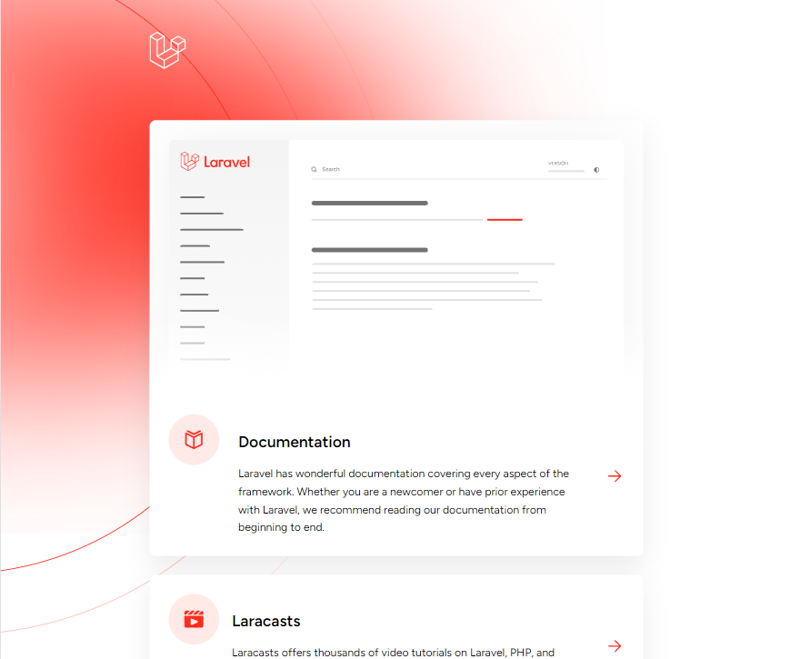

# PHP Laravel Docker Application 

  ## Description

  A starter PHP Laravel MySQL application build with Docker containers.

  
  
  ## Table of Contents
  
  - [Installation](#installation)
  - [Usage](#usage)
  - [License](#license)
  - [Contributing](#contributing)
  - [Tests](#tests)
  - [Questions](#questions)
  
  ## Installation
  
  run 'docker-compose up -d --build server' and then 'docker-compose run --rm artisan migrate' in the terminal.  This assumes you have Docker installed on your local machine already.  Then go to localhost:8000 in your browser.
  
  ## Usage
  
  This is just a starter Laravel app, so you will see the Laravel page with links to documentation and other Laravel information

  ## License
This application is covered under the MIT License.
 For more information: https://opensource.org/licenses/MIT
  
  ## Contributing
  N/A
  
  ## Tests
  N/A

  ## Questions
  Contact Info 
  GitHub user name: BillStephens2022 
  Link to GitHub profile: https://github.com/BillStephens2022 
  Email: stephensbill17@gmail.com